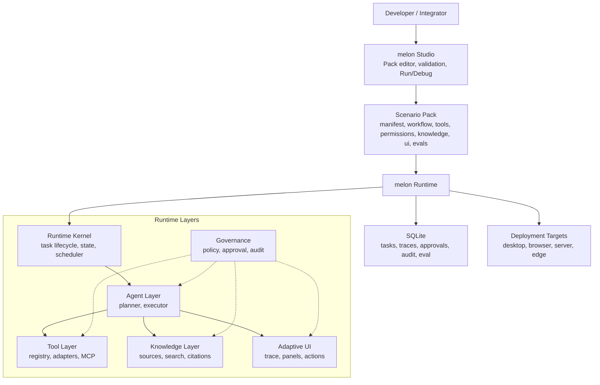
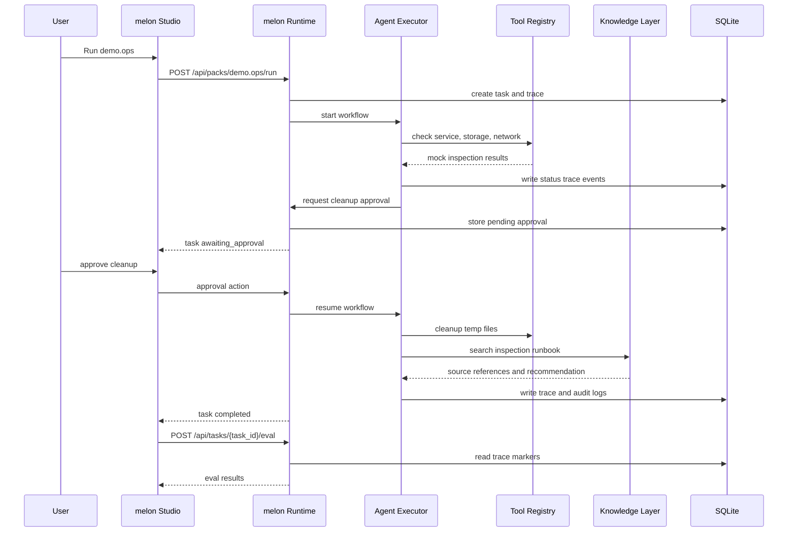

# melonOS

> Agent-native application substrate for building, running, debugging, and auditing scenario packs.

**English** | [简体中文](README.zh-CN.md)

[](https://www.rust-lang.org/)
[](https://react.dev/)
[](https://www.typescriptlang.org/)
[](https://tauri.app/)
[](#project-status)

melonOS is not a replacement for a traditional operating system. It is a local-first runtime and studio for **agent-native applications**: scenario packs that declare roles, workflows, tools, permissions, knowledge sources, UI panels, and eval cases as versioned files.

```text
melonOS = melon Runtime + Scenario Pack + melon Studio + Governance + Knowledge + Eval
```

The current repository focuses on the Alpha loop: load a scenario pack, run an agent workflow, request approval for side effects, record trace/audit logs, render debug panels, and evaluate the completed task.

## Why melonOS?

Most agent demos are hard to operate after the first run: tool calls are implicit, permissions are scattered, UI is bespoke, and correctness is judged manually. melonOS treats those concerns as first-class platform surfaces.

- **Scenario packs as apps**: a pack is a portable directory with `manifest.yaml`, workflow YAML, permission policy, tool declarations, knowledge sources, UI layout, and eval cases.
- **Auditable runtime**: every task produces trace events, approval records, audit logs, and eval results.
- **Governed actions**: side-effectful steps can pause for user approval before continuing.
- **Knowledge with citations**: local knowledge sources are loaded and surfaced through source references.
- **Studio-first debugging**: melon Studio provides pack editing, validation, Run/Debug, Trace, Audit, Eval, and layout-driven Panels.

## Project Status

melonOS is in active Alpha development. The current validated scenario is `demo.ops`, a no-hardware operations pack used to prove the platform loop before moving into real device control.

| Area | Status | Notes |
|---|---:|---|
| Runtime daemon | Alpha | Axum HTTP API, SQLite persistence, task lifecycle, trace, audit, eval |
| Scenario pack loading | Alpha | Pack discovery, file read/write, schema-backed validation |
| melon Studio | Alpha | React/Vite editor, validation, Run/Debug, approvals, trace/audit/eval, panels |
| Tool layer | Alpha | `ToolRegistry` with mock adapter path for Demo Ops |
| Knowledge layer | Alpha | Local sources and search path for Demo Ops knowledge reports |
| Governance | Alpha | Approval and audit path exists; policy engine still needs hardening |
| melon Home / device control | Planned | Starts after Alpha Demo Ops hardening |

See [doc/requirements.md](doc/requirements.md) for the detailed requirement breakdown and priority order.

## Architecture



## Quick Start

### Prerequisites

- Rust toolchain
- Node.js 20+ and npm
- macOS, Linux, or Windows with a local shell

### 1. Run the runtime

```bash
cargo run -p melon-runtime
```

The runtime listens on `127.0.0.1:8080` by default.

Useful environment variables:

```bash
MELON_BIND=127.0.0.1:18080 cargo run -p melon-runtime
MELON_DB_PATH=/tmp/melon.db cargo run -p melon-runtime
MELON_SCENARIOS_DIR=/path/to/scenarios cargo run -p melon-runtime
```

### 2. Run melon Studio

```bash
cd apps/studio
npm install
npm run dev
```

Open the Vite URL printed by the command. The Studio dev server proxies `/api/*` to the runtime.

### 3. Validate the runtime

```bash
curl -s http://127.0.0.1:8080/api/health
curl -s http://127.0.0.1:8080/api/packs
```

## Demo Ops Flow

`scenarios/demo-ops` is the current Alpha validation pack. It does not require hardware.

1. Open `Demo Ops` in melon Studio.
2. Click `Run`.
3. Inspect trace events in the Run/Debug panel.
4. Approve the pending cleanup action.
5. Wait for the task to reach `completed`.
6. Run Eval and confirm the Demo Ops cases pass.

The expected closed loop is:



## Repository Layout

```text
melon-os/
├── apps/
│   └── studio/                 # melon Studio, React + TypeScript + Vite
├── crates/
│   ├── melon-runtime/          # HTTP daemon, routing, persistence integration
│   ├── melon-agent/            # Workflow executor and task execution logic
│   ├── melon-tools/            # Tool registry and adapters
│   ├── melon-kb/               # Local knowledge loading and search
│   ├── melon-permission/       # Governance primitives
│   ├── melon-scenario/         # Scenario pack schema and validation
│   ├── melon-mcp/              # MCP integration surface
│   └── melon-ui-protocol/      # Adaptive UI protocol types
├── scenarios/
│   ├── demo-ops/               # Alpha no-hardware validation pack
│   └── melon-home/             # Planned Home Assistant beta pack
├── doc/
│   ├── requirements.md         # MVP requirements, status, and priority map
│   └── phase0-code-review.md   # Phase 0 review notes
└── docs/
    └── decisions/              # Architecture decision records
```

## Scenario Pack Anatomy

A scenario pack is a filesystem-native app contract:

```text
scenarios/demo-ops/
├── manifest.yaml               # Pack identity, runtime requirement, entrypoint
├── role.md                     # Agent role and operating constraints
├── workflows/default.yaml      # Workflow steps
├── tools/tools.yaml            # Tool declarations
├── permissions/policy.yaml     # Approval and risk policy
├── knowledge/sources.yaml      # Knowledge source declarations
├── knowledge/fixtures/*.md     # Local knowledge content
├── ui/layout.yaml              # Runtime-driven Studio panel layout
└── evals/cases.yaml            # Task-level eval cases
```

This structure is intentional: packs should be reviewable, portable, testable, and auditable with ordinary developer workflows.

## Development

### Common Commands

```bash
# Rust checks and tests
cargo check
cargo test

# Studio tests and production build
cd apps/studio
npm test
npm run build

# Runtime
cargo run -p melon-runtime
```

### API Surface

The Alpha runtime exposes local HTTP endpoints for Studio and black-box verification:

| Endpoint | Purpose |
|---|---|
| `GET /api/health` | Runtime health |
| `GET /api/packs` | List scenario packs |
| `POST /api/packs/{pack_id}/validate` | Validate a pack |
| `GET /api/packs/{pack_id}/files` | List pack files |
| `GET /api/packs/{pack_id}/files/{path}` | Read a pack file |
| `PUT /api/packs/{pack_id}/files/{path}` | Write a pack file |
| `POST /api/packs/{pack_id}/run` | Run a pack workflow |
| `GET /api/tasks/{task_id}` | Read task status |
| `GET /api/tasks/{task_id}/traces` | Read trace events |
| `GET /api/tasks/{task_id}/approvals` | List pending approvals |
| `POST /api/tasks/{task_id}/approvals/{approval_id}/action` | Approve or reject an action |
| `GET /api/tasks/{task_id}/audit` | Read audit logs |
| `POST /api/tasks/{task_id}/eval` | Run eval cases for a completed task |
| `GET /api/packs/{pack_id}/knowledge/sources` | List pack knowledge sources |
| `GET /api/packs/{pack_id}/knowledge/search?q=...` | Search pack knowledge |

## Roadmap

### Milestone 1: Pack Loading and Studio Foundation

- Scenario pack schema and validation
- Pack list and editor
- Runtime-backed file read/write
- SQLite-backed task, trace, and basic metadata persistence

### Milestone 2: Demo Ops Alpha

- Tool registry and mock adapter path
- Knowledge retrieval with source references
- Run/Debug trace inspector
- Approval and audit loop
- Layout-driven Studio panels
- Task-level eval closure for `demo.ops`

### Milestone 3: melon Home Beta

- Home Assistant adapter
- Low-risk device control path
- Device operation trace and audit
- Approval gates for medium/high-risk home actions

## Design Principles

- **Local first**: development and Alpha validation should run on a local machine without cloud infrastructure.
- **Files are the contract**: scenario behavior should be inspectable through pack files, not hidden in Studio-only state.
- **Trace everything important**: tool calls, approvals, knowledge references, and task state changes must be observable.
- **Govern side effects**: potentially destructive actions should be explicit, reviewable, and auditable.
- **Keep the MVP narrow**: prove the platform loop before adding broad device coverage or visual builders.

## Documentation

| Document | Description |
|---|---|
| [Requirements](doc/requirements.md) | MVP requirements, priority order, current progress |
| [Technical Plan](melonOS%20技术方案.md) | Architecture, product layers, and technical direction |
| [MVP Plan](melonOS%20MVP%20开发计划.md) | Milestones, timeline, acceptance criteria |
| [melon Home Plan](melon%20Home%20全屋智能技术方案.md) | Home Assistant beta scenario design |
| [Agents OS Feasibility](Agents%20OS%20可行性与产品方案.md) | Product positioning and staged strategy |

## Contributing

This repository is moving quickly. Before opening a large change, align it with the current milestone in [doc/requirements.md](doc/requirements.md).

Baseline checks before committing:

```bash
cargo test
cd apps/studio && npm test && npm run build
```

Prefer small commits with semantic messages, for example:

```text
feat: add task eval endpoint
fix: clear stale eval result after approval
docs: refresh runtime quick start
```

## License

No license has been declared yet.
